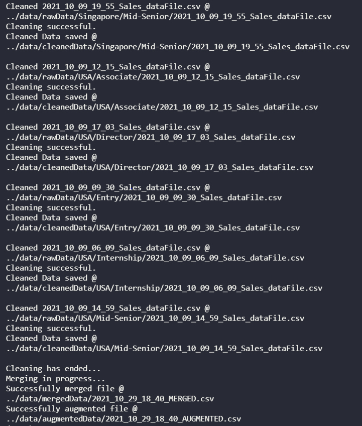

# Job Extract User Guide


## Table of Contents
  * [Installation](#installation)
  * [User Guide for different Modules](#user-guide-for-different-modules)
    + [Crawler](#crawler)
    + [Processor](#processor)
    + [GUI](#gui)

## Installation

The installation guide can be found [here](./Installation.md).

## User Guide for different Modules
### Crawler
To use the crawler, navigate to `crawler.py` in the directory –
```
cd ./src/controller
```
 Then navigate down the bottom of the page. You will then see this block of
code:
```python
if __name__ == "__main__":
    myCrawler = Crawler()
    myCrawler.startCrawler("Sales", "Singapore", "Internship", 5)
```
Use the `startCrawler` function to run the crawler. Here is the documentation for the function.

```python
def startCrawler(self, job: str, location: str, seniorityLevel: str, count: int) -> None:
'''
    job : str => Selects job title to scrape
    location : str => Selects location to scrape
    seniorityLevel : str => Selects job seniority level to scrape
    Available Parameters:
    "All",
    "Internship",
    "Entry",
    "Associate",
    "Mid-Senior",
    "Director"
    count : int => Number of jobs to search (maximum 1000)
'''
```
For example, to crawl 5 samples of data for internship level sales jobs in Singapore, input the following code:
```python
if __name__ == "__main__":
    myCrawler = Crawler()
    myCrawler.startCrawler("Sales", "Singapore", "Internship", 5)
 ```
Run the code in your terminal using the following command  and make sure that you are in the directory `./src/controller`
```
py crawler.py
```
After running the code, wait for the browser to finish crawling the data file, and you should see this printed in your terminal: 


The scraped data file will now be in the directory
`./src/data/rawData/{location}/{seniorityLevel}/{timeStampedData.csv}`

### Processor
The processor is used to process raw data into processed data, making it easier to be used for data analysis.<br/>

The main 3 functions of it are:
- **Cleaner** -> `cleaner.py` - Clean `rawData` files into `cleanedData` files. Remove non English language data samples, set location of data samples, clean description to remove stop words, stem description and remove punctuation. Cleaned excel file is stored in `./src/data/cleanedData/{location}/{seniorityLevel}/{cleanedCSVfile.csv}`
- **Merger** -> `merger.py` – Merge all cleanedData files into a single file. Merged excel file is stored in `./src/data/mergedData/{mergedCSVFile.csv}`
- **Augmentor** -> `augmentor.py` – Adds in numerical data columns to help in data analysis. Augmented excel file is stored in `./src/data/augmentedData/{mergedCSVFile.csv}`

To use the processor, navigate to `processor.py` using the following command if you are in the root folder.
```
cd ./src/controller.
```

Then navigate down the bottom of the page. You will then see this block of code: 
```python
if __name__ == "__main__":
    myProcessor = Processor(format="all")
    myProcessor.process()
```

Use the `process` function to run the processor. Here is the documentation for the processor object:

```python
def __init__(self, format: str, manualFilePath: Optional[str]=None) -> Processor:
    '''
        format: str => Defines which files are to be processed.
        Available Parameters:
        •	"all" => Processes all files in all rawData directories,
        •	"latestAll" => Processes latest files in all rawData directories
        •	"single" => Processes single file, manualFilePath attribute needed
        manualFilePath: str (Optional) => Specifies path for "single" format processing.

    '''

def process(self) -> None:
    '''
        Main function, cleans files according to format class attribute, merges them together, then augments data points, saving it to a new file.
        Parameters: None
        Returns: None
    '''
```
The parameter `format` is used to decide which files are to be processed. For example, if you would like to clean all files, use the *all* parameter.

After running the code, this will be logged in the terminal:



The file will then be saved to the directory: 
`./src/data/augmentedData/{ProcessedFile.csv}`

### GUI
